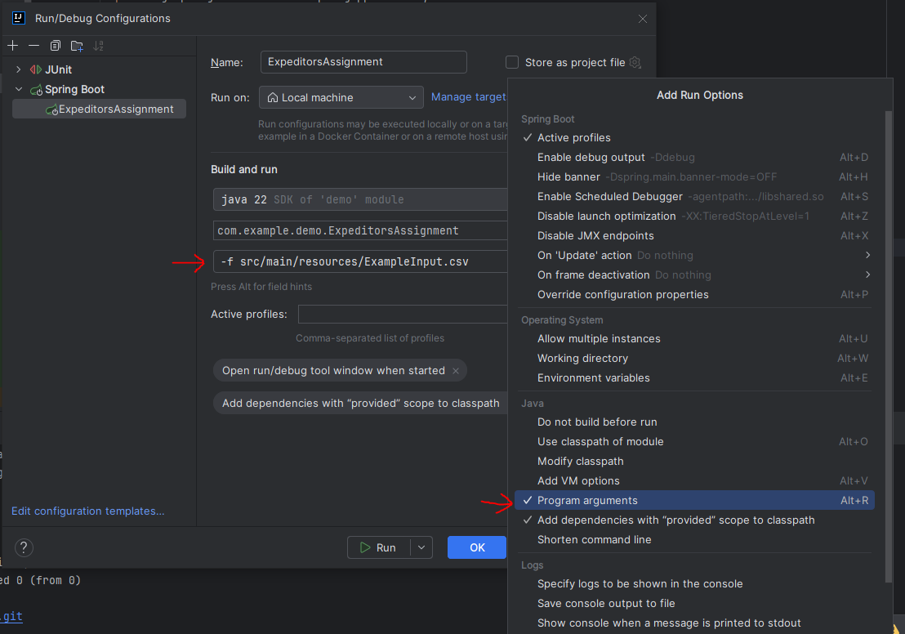
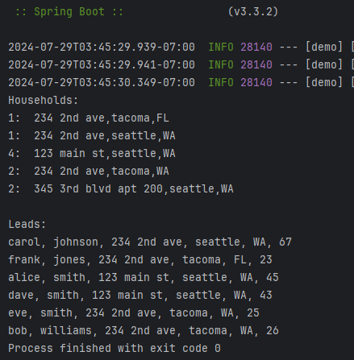

# Introduction

This project is created to complete an interview exercise for Expediters. The prompt is listed below.

In this project I decided to create a simple Spring Boot project to demonstrate how I might create a simple module in
an enterprise web-server code base. I use comments to provide commentary, such as calling attention to places where a "real"
integrated module could benefit from additional effort or complexity, but have elided such effort in the context of this
exercise. Normally I would not add nearly so many comments!

# How to run

The program is a command line program with the following interface:

Arg0: Indicates if the first argument should be parsed, or if it takes a csv file to be parsed instead.

Arg1: Function depends on arg0:
- `-f`: File path to input file that must be parsed. This argument is required. The file must be a CSV in the form given in the assignment prompt.
- `-s`: Input is a string to be parsed directly. Must be in CSV in the form given in the assignment prompt.

Arg2: Output file path. This argument is optional. If not provided, the output is sent to the terminal.

## Quick start with IntelliJ

Edit the run configuration, then click "modify options", select "program arguments", then use the following argument:
`-f src/main/resources/ExampleInput.csv`

# I trust it works, just show me the output!

Simply open the file `ExampleOutput.txt` in the root directory. Alternatively, see the picture below:

# Prompt:

Exercise Summary:
This Developer Design and Development exercise is used in the evaluation process for potential new hire candidates.  Please approach this exercise as you would approach a design and development project at work and include unit tests.  Any documentation or explanations about your approach and assumptions are helpful.  Please post your completed exercise on Github and send a link back to your recruiting contact at Expeditors when complete.

Requirements:
Write a standalone executable or script using the language of your preference (Java is the primary dev language at Expeditors).  Given the provided input data, print the expected output to the console or write to a text file.  Please also include Java unit tests that test your code.

Input data:
"Dave","Smith","123 main st.","seattle","wa","43"
"Alice","Smith","123 Main St.","Seattle","WA","45"
"Bob","Williams","234 2nd Ave.","Tacoma","WA","26"
"Carol","Johnson","234 2nd Ave","Seattle","WA","67"
"Eve","Smith","234 2nd Ave.","Tacoma","WA","25"
"Frank","Jones","234 2nd Ave.","Tacoma","FL","23"
"George","Brown","345 3rd Blvd., Apt. 200","Seattle","WA","18"
"Helen","Brown","345 3rd Blvd. Apt. 200","Seattle","WA","18"
"Ian","Smith","123 main st ","Seattle","Wa","18"
"Jane","Smith","123 Main St.","Seattle","WA","13"

Expected output:
Each household and number of occupants, followed by:
Each First Name, Last Name, Address and Age sorted by Last Name then First Name where the occupant(s) is older than 18

